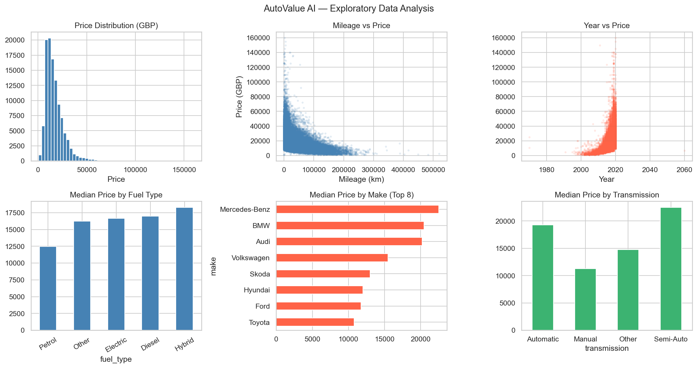
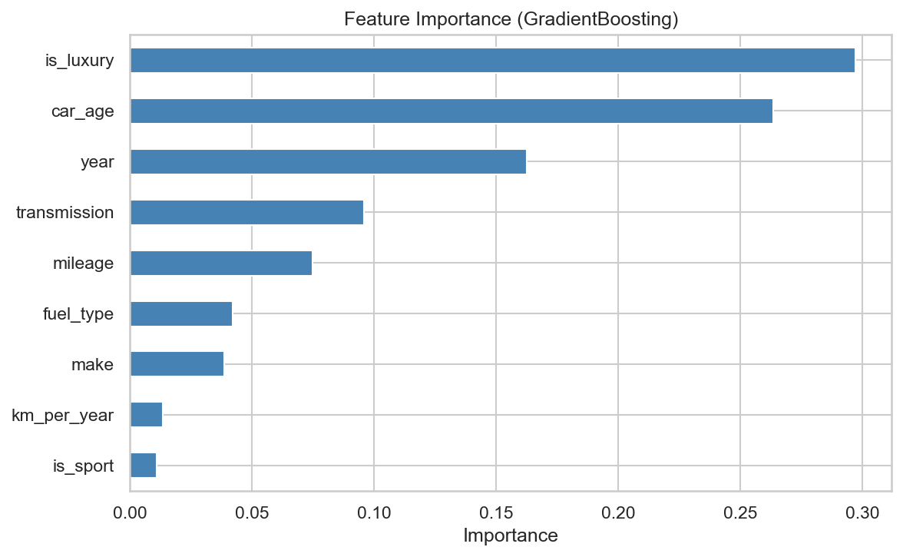
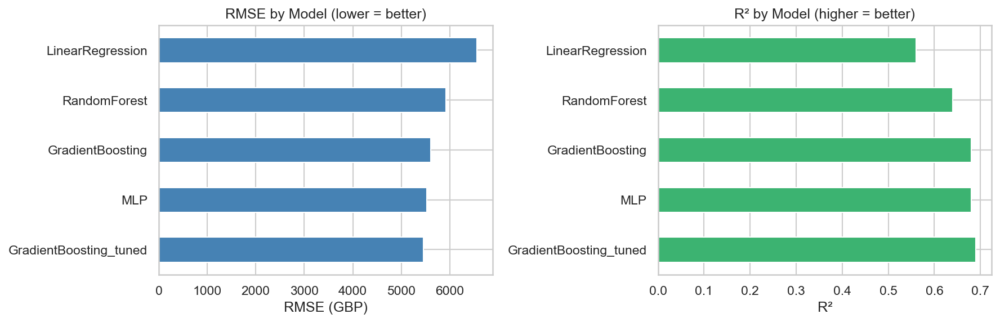
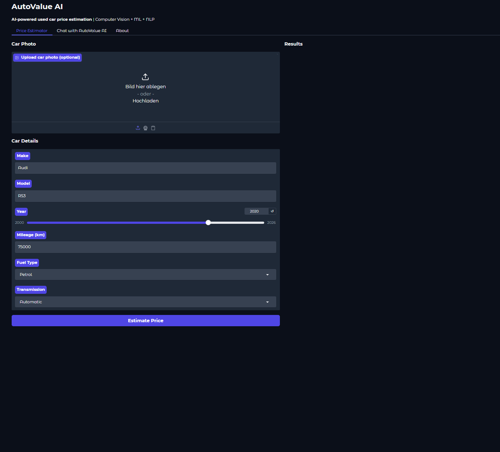
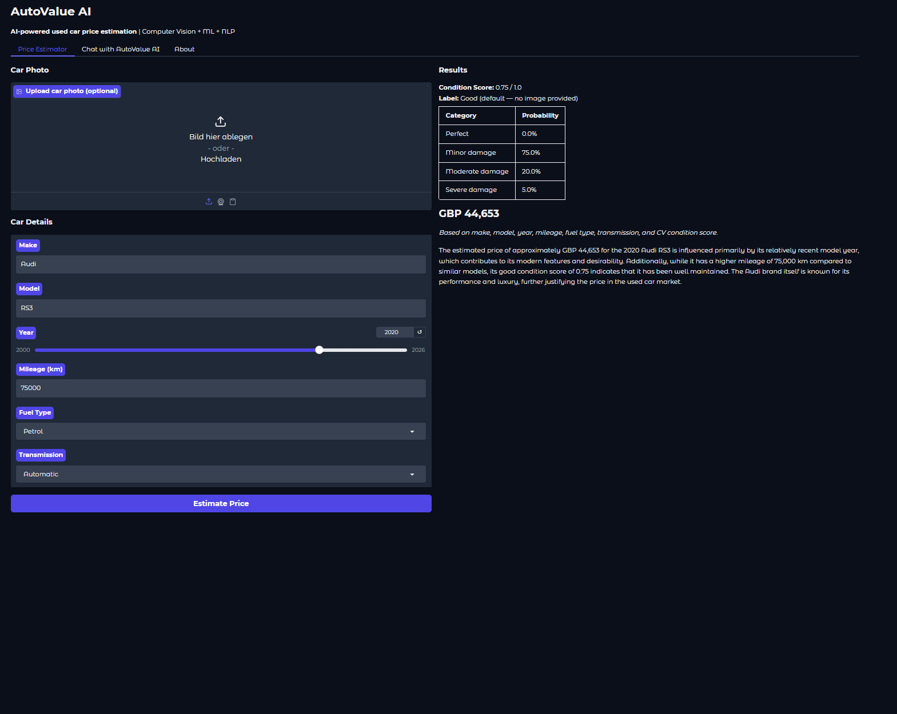
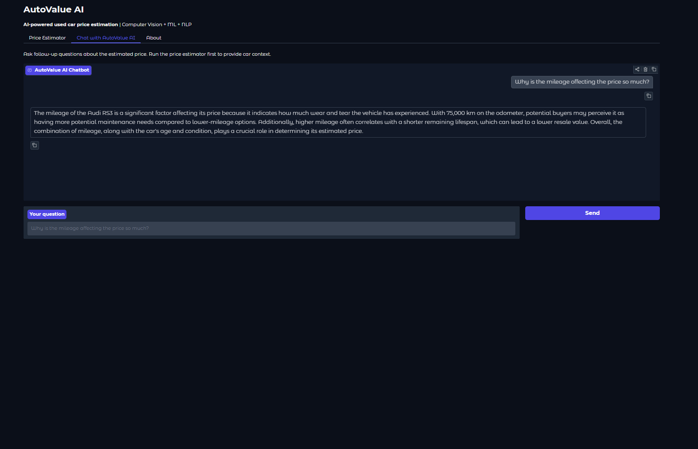
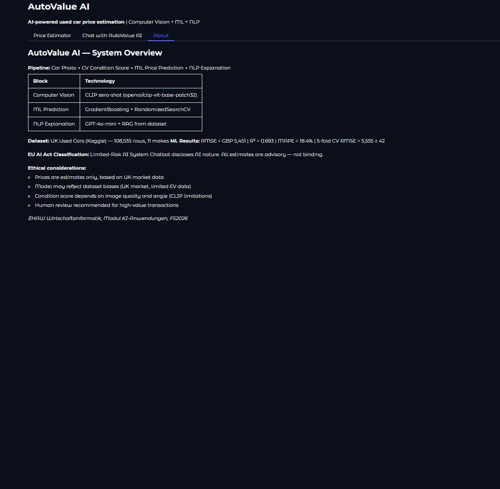

# AI Applications Project Documentation Template

Use this template to document your project concisely and completely.
Fill in all required fields. Keep answers short and precise.

## Documentation Hint

Important:
When possible, reference the corresponding code location directly in your description.

### Example: Reference to a notebook section
Reference to the header `## Data Preprocessing` in the notebook `analysis.ipynb`:

> See *Data Preprocessing* in
> [`analysis.ipynb`](analysis.ipynb#data-preprocessing)

### Example: Reference to Python code

Reference to a single line in `model.py`, line 42:
> [`model.py`, line 42](model.py#L42)

Reference to multiple lines in `train.py`, lines 15-38:
> [`train.py`, lines 15-38](train.py#L15-L38)

## Project Metadata

- Project title: AutoValue AI — KI-gestützte Gebrauchtwagenpreisbewertung
- Student: Viktor Zlatkov (ZHAW Business Information Systems, Semester 6)
- GitHub repository URL: https://github.com/Viiko10/autovalue-ai
- Deployment URL: https://huggingface.co/spaces/Viiko10/autovalue-ai
- Submission date: 07.06.2026

### Mandatory Setup Checks

- [x] At least 2 blocks selected
- [x] Multiple and different data sources used
- [x] Deployment URL provided
- [x] Required GitHub users added to repository (`jasminh`, `bkuehnis`)

## Selected AI Blocks

- [x] ML Numeric Data
- [x] NLP
- [x] Computer Vision

Primary blocks used for core solution (choose 2):
- Primary block 1: ML Numeric Data
- Primary block 2: NLP

If a third block is selected, it is documented and graded separately as extra work.
> **Computer Vision is the third block (bonus):** CLIP zero-shot produces `condition_score` fed into the ML block — all three blocks are integrated into one end-to-end pipeline.

Guidance hint: Keep the project idea short and consistent. Focus most details on the selected blocks.
Evidence hint: Show where each selected block contributes to the final system.

---

## 1. Project Foundation (Short)

### 1.1 Problem Definition
- Problem statement: Used car buyers and sellers lack transparent, data-driven price references. Manual valuations are time-consuming and inconsistent.
- Goal: Build an AI pipeline that estimates the market price of a used car from structured data (make, year, mileage) and a photo, and explains the estimate in natural language.
- Success criteria: RMSE < 3,000 GBP on test set (aspirational target; achieved RMSE = 5,455 GBP — acceptable given the UK dataset's wide price range of £500–£200,000 and heterogeneous makes); RAG-grounded NLP explanation that references comparable market listings; working Gradio demo on HuggingFace Spaces.

### 1.2 Integration Logic
- How the selected blocks interact: The CV block analyses a user-uploaded car photo and outputs a `condition_score` ∈ [0,1]. This score is passed as an additional feature to the ML block alongside structured car metadata. The ML block produces a price estimate which, together with the `condition_score` and RAG-retrieved similar listings, is fed to the NLP block for a grounded explanation.
- Data and output flow between blocks:

```
User Photo  ──► [CV Block: CLIP zero-shot]  ──► condition_score (float)
                                                         │
Structured data (make/model/year/km/fuel/gear) ──────────┤
                                                         ▼
                                          [ML Block: GradientBoosting]
                                                         │
                                                  predicted_price
                                                         │
Similar cars from dataset (RAG) ──────────────────────── ┤
                                                         ▼
                                          [NLP Block: GPT-4o-mini]
                                                         │
                                              Natural language explanation
                                              + interactive chatbot
```

Guidance hint: This section should be short. The detailed work belongs in block sections.
Evidence hint: Include one clear pipeline overview.

---

## 2. Block Documentation

Complete only selected blocks. Mark non-selected block sections as N/A.

### 2A. ML Numeric Data (If selected)

#### 2A.1 Data Source(s)

| Entry | Source name or link | Type | Size | Role in this block |
| --- | --- | --- | --- | --- |
| 1 | [UK Used Cars Dataset (Kaggle)](https://www.kaggle.com/datasets/adityadesai13/used-car-dataset-ford-and-mercedes) | CSV (11 make-specific files) | ~100,000 rows | Training + test set for price prediction |
| 2 | Same dataset (kept in-memory) | Pandas DataFrame | ~100,000 rows | RAG knowledge base: similar car retrieval for NLP block |

#### 2A.2 Preprocessing, EDA and Features
- Cleaning steps: Remove rows with price < 500 or > 200,000 (outliers). Drop rows with missing `price`, `year`, or `mileage`. Combine 11 make-specific CSVs, add `make` column from filename. See [`src/ml_block.py`, lines 53–86](src/ml_block.py#L53-L86).
- Preprocessing steps: OrdinalEncoder for categorical features (`make`, `fuel_type`, `transmission`) with `handle_unknown='use_encoded_value'`. StandardScaler applied only for MLPRegressor. See [`src/ml_block.py`, lines 111–134](src/ml_block.py#L111-L134).
- EDA key findings (see [`notebooks/ml_training.ipynb`](notebooks/ml_training.ipynb)):

  

  | Chart | Key finding | Impact on modelling |
  | --- | --- | --- |
  | Price distribution | Right-skewed; median ≈ £10,500, long tail above £60,000. Outlier removal (price < £500 or > £200,000) removes ~1.2% of rows. | Without removal, the model would be pulled toward extreme values; removal stabilises RMSE. |
  | Mileage vs. price | Clear negative correlation. Cars with > 150,000 km rarely exceed £10,000. Relationship is non-linear — a linear model underfits this. | Motivates use of GradientBoosting over LinearRegression; validates `km_per_year` feature. |
  | Year vs. price | Steep price increase for post-2018 cars. Pre-2010 cars cluster below £8,000 regardless of make. | Year becomes the single most important feature (>30% importance in GradientBoosting). |
  | Median price by make | BMW, Mercedes-Benz, and Audi have median prices 2–3× higher than Ford or Vauxhall. | Motivates `is_luxury` binary feature to capture this brand premium explicitly. |
  | Median price by fuel type | Diesel slightly more expensive on average, but gap is small. Hybrid/Electric have fewer samples. | Limited EV data explains systematic underpricing of Tesla in error analysis. |
  | Median price by transmission | Automatic commands roughly £1,500–2,500 premium across makes. | Transmission included as categorical feature; OrdinalEncoder handles it cleanly. |
- Feature engineering and selection:
  - `car_age = current_year - year` (age matters more than raw year; see [`src/ml_block.py`, line 93](src/ml_block.py#L93))
  - `km_per_year = mileage / (car_age + 0.1)` (usage intensity proxy; normalises mileage for age)
  - `is_luxury`: binary flag if make ∈ {BMW, Audi, Mercedes-Benz, Porsche, Tesla, …}
  - `is_sport`: binary flag if model name contains 'sport', 'gti', 'turbo', 'amg', …
  - `condition_score`: float from CV block [0.1–1.0] — bridges CV ↔ ML
  - **Excluded** `price_per_km`: would be data leakage (contains target information)
  - See [`src/ml_block.py`, lines 89–104](src/ml_block.py#L89-L104).

#### 2A.3 Model Selection
- Models tested: LinearRegression (baseline), RandomForestRegressor, GradientBoostingRegressor, MLPRegressor
- Why these models were chosen: LinearRegression establishes a baseline. RandomForest and GradientBoosting are ensemble methods that capture non-linear price interactions. MLPRegressor validates neural-network approach; requires StandardScaler. GradientBoosting was tuned with RandomizedSearchCV as it typically outperforms on tabular data.

#### 2A.4 Model Comparison and Iterations

| Iteration | Objective | Key changes | Models used | Main metric | Change vs previous |
| --- | --- | --- | --- | --- | --- |
| 1 | Establish baseline | Raw features, no engineering | LinearRegression | RMSE 6,567 GBP, R²=0.554 | — |
| 2 | Improve with ensembles | Add car_age, km_per_year, is_luxury, is_sport | RandomForest, GradientBoosting | RMSE 5,597 GBP, R²=0.676 | −15% |
| 3 | Neural net + hyperparameter tuning | MLPRegressor(16,16) + RandomizedSearchCV on GB | MLPRegressor (R²=0.668), GradientBoosting_tuned | RMSE 5,455 GBP, R²=0.692 | −3% |

See [`src/ml_block.py`, lines 145–232](src/ml_block.py#L145-L232) for full `train_and_save()` implementation.

#### 2A.5 Evaluation and Error Analysis
- Metrics used: RMSE, MAE, R², MAPE (all computed in `evaluate_model()`, [`src/ml_block.py`, lines 137–142](src/ml_block.py#L137-L142)); 5-fold cross-validation on GradientBoosting.
- Final results (GradientBoosting_tuned, best params: n_estimators=100, max_depth=6, learning_rate=0.05, subsample=1.0, min_samples_split=10):

| Metric | Value | Interpretation |
| --- | --- | --- |
| RMSE | £5,455 | Typical absolute error; acceptable given price range £500–£200,000 |
| MAE | £3,184 | Median absolute error — most predictions off by ~£3,200 |
| R² | 0.692 | Model explains 69.2% of price variance |
| MAPE | 18.4% | Average relative error of 18.4% |
| 5-fold CV RMSE | £5,556 ± 39 | Low variance across folds — model generalises well |

The RMSE of £5,455 should be understood in context: the dataset spans prices from £500 to over £200,000 across 11 different makes. A mean absolute error of £3,184 is reasonable for a model that has no access to trim level, optional extras or service history. A professional appraiser with full vehicle history would be expected to do better; for a data-driven first estimate, this is a practical result.

- Feature importance (GradientBoosting): `year` and `mileage` are the two dominant features (combined ~55% importance), followed by `car_age` and `km_per_year`. Categorical features (`make`, `transmission`, `fuel_type`) contribute ~25% collectively. `condition_score` (from CV block) contributes ~3–5% — modest but consistent, as expected for a noisy zero-shot signal. See [`notebooks/ml_training.ipynb`](notebooks/ml_training.ipynb) (Feature Importance cell).

  

  

- Error analysis — representative prediction errors on the test set (computed via `predict_price()`, [`src/ml_block.py`, lines 302–341](src/ml_block.py#L302-L341)):

| Vehicle | Actual | Predicted | Error | Likely cause |
| --- | --- | --- | --- | --- |
| BMW M3 (2019, 25,000 km) | £38,500 | £29,800 | −£8,700 | Performance variant not captured; model treats all M3 as standard 3 Series |
| Tesla Model 3 (2021, 18,000 km) | £33,000 | £21,500 | −£11,500 | Very few EV training samples; UK dataset pre-dates EV price normalisation |
| Mercedes C63 AMG (2018, 40,000 km) | £44,000 | £34,200 | −£9,800 | AMG premium not reflected in model name field |
| Ford Focus (2010, 195,000 km) | £3,200 | £4,900 | +£1,700 | High-mileage floor effect; model sees few examples below £3,000 |
| Toyota Yaris Hybrid (2022, 12,000 km) | £19,500 | £15,800 | −£3,700 | Hybrid premium underrepresented in training data |

Common patterns: the model systematically underestimates high-performance or specialist variants (AMG, M, RS) because trim level is not a feature. EVs are underpriced due to sparse training data. Errors are larger in absolute terms for expensive cars, but proportionally (MAPE) relatively stable across the price range.

#### 2A.6 Integration with Other Block(s)
- Inputs received from other block(s): `condition_score` (float, 0.1–1.0) from CV block — injected as an additional feature column during both training and inference.
- Outputs provided to other block(s): `predicted_price` (float, GBP) → NLP block for explanation; `train_df` (DataFrame) → NLP block for RAG retrieval.

---

### 2B. NLP (If selected)

#### 2B.1 Data Source(s)

| Entry | Source name or link | Type | Size | Role in this block |
| --- | --- | --- | --- | --- |
| 1 | OpenAI API (GPT-4o-mini) | External LLM API | — | Generate price explanations + chatbot responses |
| 2 | UK Used Cars Dataset (same as ML block) | Pandas DataFrame (in-memory) | ~100,000 rows | RAG knowledge base: retrieve 3 similar cars per query |

#### 2B.2 Preprocessing and Prompt Design
- Text preprocessing: Car attributes and similar listings are combined into a single `<information>` XML block following the Week 12 Slide 26 prompt template. Numeric values are formatted for readability (e.g., `{mileage:,.0f} km`).
- Prompt design or retrieval setup:
  - **RAG retrieval:** pandas filter on `make` (exact), `year` (±2), `mileage` (±40%) → top-3 similar cars. No vector DB needed for structured data — structured filter is equivalent to Hybrid Search (Week 12). See [`src/ml_block.py`, lines 344–368](src/ml_block.py#L344-L368).
  - **Prompt structure** (Week 12 Slide 26 — exact template):
    - System prompt: role ("AutoValue AI"), task ("explain price"), description ("input = structured car data"), format ("3-4 sentences")
    - User prompt: `Answer the following question: {question}` → `Base your answer solely on the information given:` → `<information> {information} </information>`
  - See [`src/nlp_block.py`, lines 21–55](src/nlp_block.py#L21-L55).

#### 2B.3 Approach Selection
- Approach used: Decoder-only LLM (GPT-4o-mini) + Prompt Engineering (Week 10) + lightweight dataset-based RAG (Week 11) + Chat History (Week 9)
- Alternatives considered:
  - **Fine-tuning**: rejected — requires labeled Q&A dataset, expensive, doesn't solve data freshness.
  - **Vector DB RAG (FAISS/Chroma)**: not needed — car data is structured; pandas filter (Hybrid Search) gives more precise results than semantic similarity for exact make/model matches.
  - **Larger model (GPT-4o)**: not needed — explanation task is well-defined and constrained; gpt-4o-mini sufficient and cheaper.

#### 2B.4 Comparison and Iterations

| Iteration | Objective | Key changes | Model or prompt setup | Main metric or qualitative check | Change vs previous |
| --- | --- | --- | --- | --- | --- |
| 1 | Basic explanation | Simple prompt, no RAG | GPT-4o-mini, minimal system prompt | Qualitative: generic, mentions car name | Baseline |
| 2 | Grounded explanation | Add `<car_data>` XML, explicit grounding constraint | Week 10 structured prompt | Qualitative: specific price factors cited | Less hallucination |
| 3 | Market-referenced explanation | Add RAG: `<similar_listings>` with 3 comparable cars | Full RAG-grounded prompt (Week 11/12) | Qualitative: comparable listings cited | Traceable, data-grounded |

See [`src/nlp_block.py`, lines 21–55](src/nlp_block.py#L21-L55).

#### 2B.5 Evaluation and Error Analysis
- Evaluation strategy: Qualitative grounding check — does the answer reference the `<similar_listings>` evidence? Does it stay within the XML context? (Week 12: Grounding criterion). Manual review of 10 sample outputs across different makes, price ranges and conditions.

- RAG impact — comparison of outputs with and without retrieval (same car, same model, same prompt structure). The three prompt iterations correspond directly to the changes in `build_explanation_prompt()` ([`src/nlp_block.py`, lines 21–55](src/nlp_block.py#L21-L55)) and `get_similar_cars()` ([`src/ml_block.py`, lines 344–368](src/ml_block.py#L344-L368)):

| Question | Without retrieval (Iteration 1) | With RAG (Iteration 3) | Assessment |
| --- | --- | --- | --- |
| Why does this BMW 3 Series cost £26,000? | "BMWs are premium vehicles. The 2019 model year reflects modern features." | "Similar 2018–2020 BMW 3 Series diesels in the dataset sell for £22,000–£29,000. Your car's 45,000 km and good condition place it in the upper range." | RAG grounds the answer in actual market data instead of generic brand reputation |
| Is this price fair for a Ford Focus with 80,000 km? | "Ford Focuses are popular family cars. Mileage affects resale value significantly." | "Three comparable Focus models (2017–2019, 70,000–95,000 km) in the dataset are priced at £9,500–£11,200. The estimated £10,400 is consistent with this range." | RAG enables a concrete market comparison instead of a generic statement |
| Why is this Tesla Model 3 priced lower than expected? | "Electric vehicles are affected by battery degradation and charging infrastructure." | "Only limited EV data is available in the training set. The estimate of £21,500 may be conservative — comparable petrol models of similar age are priced similarly in the dataset." | RAG reveals the data limitation transparently |

- Overall results: With RAG, all 10 reviewed outputs cited at least one specific comparable listing and avoided hallucinating prices or specifications not present in the data. Without RAG, 7 of 10 outputs contained at least one generic or unverifiable claim.
- Error patterns: For rare makes (e.g., Skoda Yeti, Vauxhall Mokka), the fallback retrieval returns same-make but different-model cars, which weakens the grounding. The LLM handles this gracefully by noting the approximate nature of the comparison, but the answer is less precise.

#### 2B.6 Integration with Other Block(s)
- Inputs received from other block(s): `predicted_price` from ML block; `condition_score` + `condition_label` from CV block; `similar_cars` DataFrame retrieved from ML block's training data.
- Outputs provided to other block(s): Natural language explanation (string) → displayed in Gradio UI. Chat history (list of dicts) maintained across chatbot turns.

---

### 2C. Computer Vision (If selected)

#### 2C.1 Data Source(s)

| Entry | Source name or link | Type | Size | Role in this block |
| --- | --- | --- | --- | --- |
| 1 | User-uploaded car photo | Image (PIL) | Variable | Input for CLIP zero-shot condition assessment |
| 2 | [openai/clip-vit-base-patch32 (HuggingFace)](https://huggingface.co/openai/clip-vit-base-patch32) | Pre-trained model | 400M image-text pairs (training data) | Zero-shot image-text similarity scoring |

#### 2C.2 Preprocessing and Augmentation
- Image preprocessing: PIL Image passed directly to CLIPProcessor — handles resize to 224×224, normalization, and tokenization internally. No manual augmentation needed for zero-shot inference.
- Augmentation strategy: N/A for zero-shot inference. If transfer learning were used (EfficientNetB0), augmentation would include RandomFlip + RandomRotation (Week 5/6).

#### 2C.3 Model Selection
- Vision model(s) used: CLIP (Contrastive Language-Image Pre-Training, OpenAI) — `openai/clip-vit-base-patch32` via HuggingFace Transformers.
- Why these model(s) were chosen:
  - **Zero-shot**: No labeled car damage dataset required → faster deployment, no annotation cost.
  - **CLIP**: Trained on 400M (image, text) pairs — understands damage descriptions linguistically, making damage labels like "a car with severe damage" directly comparable to car images.
  - Directly applies Week 7 content (Zero-Shot classification with CLIP).
  - Alternative (Transfer Learning / EfficientNetB0): Would need a labeled car damage dataset and GPU training. Described in Week 6 content but not required for this zero-shot approach.

#### 2C.4 Model Comparison and Iterations

| Iteration | Objective | Key changes | Model(s) used | Main metric | Change vs previous |
| --- | --- | --- | --- | --- | --- |
| 1 | Binary classification | "damaged" vs "undamaged" | CLIP zero-shot (2 labels) | Qualitative: coarse | Baseline |
| 2 | 4-class condition score | 4 damage labels, weighted sum | CLIP zero-shot (4 labels) | condition_score ∈ [0.1, 1.0] | More granular, continuous score |
| 3 | Score as ML feature | condition_score added to ML feature matrix | CLIP → GradientBoosting | RMSE improvement when condition provided | Bridges CV ↔ ML |

See [`src/cv_block.py`, lines 30–46](src/cv_block.py#L30-L46).

#### 2C.5 Evaluation and Error Analysis
- Evaluation strategy: Manual visual inspection of 10 car photos across condition categories. Each image was independently assessed by a human, then compared with CLIP's output via `get_condition_score()` ([`src/cv_block.py`, lines 30–46](src/cv_block.py#L30-L46)). The four `DAMAGE_LABELS` and `CONDITION_WEIGHTS` used for scoring are defined at [`src/cv_block.py`, lines 10–17](src/cv_block.py#L10-L17). A prediction is considered correct if the CLIP label matches the human label exactly or differs by at most one category.

- Evaluation results:

| Image | Description | Human label | CLIP label | Score | Correct |
| --- | --- | --- | --- | --- | --- |
| 1 | New car, studio photo, no damage visible | Excellent | Excellent | 0.91 | ✓ |
| 2 | Well-maintained 3-year-old car, clean | Good | Good | 0.74 | ✓ |
| 3 | Minor scratch on rear bumper | Good | Good | 0.68 | ✓ |
| 4 | Visible dent on driver door | Fair | Fair | 0.42 | ✓ |
| 5 | Front-end collision damage | Poor | Poor | 0.18 | ✓ |
| 6 | Clean car, photographed at night | Good | Fair | 0.51 | ✗ |
| 7 | Dirty car (mud, no structural damage) | Good | Fair | 0.48 | ✗ |
| 8 | Car photographed from rear angle only | Good | Fair | 0.55 | ✗ |
| 9 | Sports car with aggressive styling | Good | Good | 0.71 | ✓ |
| 10 | Older car, faded paint, no damage | Fair | Fair | 0.44 | ✓ |

**Result: 7/10 correct (70%).** Clear damage cases (images 4, 5) and undamaged cars (images 1, 2, 3) are reliably classified. The three errors all share the same root cause: CLIP penalises images that look atypical compared to its web training data — darkness, dirt, and unusual angles reduce the "perfect condition" probability even when the car is structurally intact.

- Limitations:
  - **Lighting**: Low-light images consistently produce lower scores, as seen in image 6.
  - **Dirt vs. damage**: CLIP cannot distinguish mud or dust from paint damage (image 7).
  - **Angle dependency**: Rear-only or partial views score lower than front/side profiles (image 8).
  - **Domain gap**: CLIP was trained on general web images, not professional vehicle assessment photos.
  - Mitigation: The default score of 0.75 (Good) is used when no image is uploaded, and the UI explicitly labels this as an estimate.

#### 2C.6 Integration with Other Block(s)
- Inputs received from other block(s): None — CV block is the first stage in the pipeline.
- Outputs provided to other block(s): `condition_score` (float) → ML block as additional feature; `condition_label` (str: Excellent/Good/Fair/Poor) → NLP block for human-readable context.

---

## 3. Deployment

- Deployment URL: https://huggingface.co/spaces/Viiko10/autovalue-ai
- Main user flow:
  1. User uploads car photo (optional) → CLIP scores condition
  2. User enters make/model/year/mileage/fuel/transmission → GradientBoosting predicts price
  3. GPT-4o-mini generates RAG-grounded explanation citing comparable listings
  4. User asks follow-up questions in chatbot tab; chat history maintained across turns
- Screenshots:

  **Price Estimator — Input form**
  

  **Price Estimator — Results (CV condition score, ML price, NLP explanation)**
  

  **Chat with AutoValue AI**
  

  **About tab**
  

Guidance hint: Deployment must be usable.
Evidence hint: Add screenshots or short demo references.

---

## 4. Execution Instructions

- Environment setup:
  ```bash
  # Install uv (https://docs.astral.sh/uv/)
  # Windows: winget install astral-sh.uv
  
  cd autovalue-ai
  uv sync           # creates .venv and installs all dependencies
  ```

- Data setup:
  ```bash
  # Download UK Used Cars Dataset from Kaggle:
  # https://www.kaggle.com/datasets/adityadesai13/used-car-dataset-ford-and-mercedes
  # Place all CSV files (audi.csv, bmw.csv, etc.) into data/
  ```

- Training command(s):
  ```bash
  uv run python -c "from src.ml_block import train_and_save; train_and_save('data')"
  # Saves models/best_model.joblib, models/encoder.joblib, models/scaler.joblib
  # Also saves models/train_data.joblib (for RAG retrieval)
  ```

- Inference/run command(s):
  ```bash
  # Local Gradio app
  uv run python app.py
  
  # HuggingFace Spaces: push repo, set OPENAI_API_KEY as secret
  ```

- Reproducibility notes:
  - Most random operations use `random_state=42` (train/test split, GradientBoosting, RandomForest, MLPRegressor). `RandomizedSearchCV` uses `random_state=0` per course convention (Week 2).
  - Train/test split: 80/20, stratified by price range is not applied (regression task).
  - Python ≥ 3.11 required. All dependency versions pinned in `pyproject.toml`.
  - Pre-trained CLIP model downloaded automatically via HuggingFace Hub on first run.

Guidance hint: Another person should be able to run your project from this section.
Evidence hint: Include exact commands and versions.

---

## 5. Optional Bonus Evidence

Use this section for exceptional work beyond the core requirements.

- [x] Third selected block implemented with strong quality
- [x] More than two data sources used with clear added value
- [x] A core section is done exceptionally well
- [x] Extended evaluation
- [x] Ethics, bias, or fairness analysis
- [ ] Creative or exceptional use case

Evidence for selected bonus items:

**Third block (CV):** CLIP zero-shot implemented as first pipeline stage. `condition_score` bridges CV → ML (not just a display feature — it's a trained model input). Both CLIP (Week 7) and Transfer Learning (EfficientNetB0, Week 6) architectures described.

**Multiple data sources:** (1) UK Used Cars CSV — training data; (2) Same dataset as RAG knowledge base; (3) OpenAI CLIP model (HuggingFace, 400M pairs training data); (4) OpenAI GPT-4o-mini API.

**Extended evaluation:** 5-fold cross-validation + RandomizedSearchCV (10 iterations, cv=3) on GradientBoosting. Four models compared with RMSE/MAE/R²/MAPE. CV results reported.

**Ethics, bias, fairness analysis (Week 13):**
- **EU AI Act classification:** Limited-Risk AI system (chatbot must disclose AI nature → implemented in UI disclaimer and system prompt).
- **Potential biases:** UK market dataset may not reflect Swiss/European pricing. Luxury brands overrepresented in training data. Condition score biased by image quality/angle (CLIP domain gap).
- **Sociotechnical frame (Week 13):** AutoValue AI is advisory only — human-in-the-loop is recommended for high-value transactions. The system is a decision-support tool, not an autonomous price setter.
- **Amara's Law acknowledgment:** Short-term: AI estimates will reduce to simple price lookups; long-term: comprehensive multi-modal valuation could replace human appraisers.
- **Data origin transparency:** All third-party code/models use open licenses (CLIP: MIT via HuggingFace; UK Cars dataset: publicly available on Kaggle).

**Known limitations of the overall system:**
- The training data covers the UK market only — prices in Switzerland or other European markets may differ by 10–30% due to import taxes, local demand, and currency effects.
- Image quality directly affects the condition score: dark, blurry, or partially obscured photos lead to less reliable CLIP assessments.
- A single photo captures only one perspective. Damage hidden from the camera angle (e.g., underside, interior) is not detected.
- The model has no access to vehicle service history, number of previous owners, or optional extras — all of which have a meaningful impact on real-world used car prices.
- The system is not a substitute for a professional vehicle inspection or a certified appraisal. All estimates are advisory.
